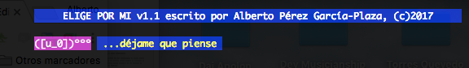
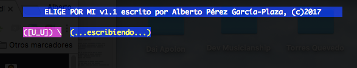
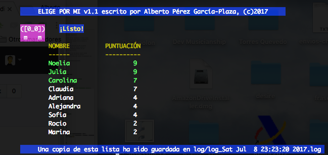

# epm
Baby name chooser. Let the AI choose for you.

Choosing the name of your children is one of the biggest unsolved problems I can imagine. Computer engineers spend the whole day writing algorithms to solve problems. This project intends to build a simple but fair algorithm to help people around the world find a solution in a reasonable time. [Contributions are welcome](#How-to-contribute)!!






# Usage
```
python3 src/elige_por_mi.py
usage: elige_por_mi.py [-h] -a LISTA_1 -b LISTA_2 [-r RANKING_FILE]
elige_por_mi.py: error: the following arguments are required: -a/--list1, -b/--list2
```

```
python3 src/elige_por_mi.py -h
usage: elige_por_mi.py [-h] -a LISTA_1 -b LISTA_2 [-r RANKING_FILE]

Elijo nombre por ti si me das un par de listas.

optional arguments:
  -h, --help            show this help message and exit
  -a LISTA_1, --list1 LISTA_1
                        lista de 6 nombres
  -b LISTA_2, --list2 LISTA_2
                        lista de 6 nombres
  -r RANKING_FILE, --ranking RANKING_FILE
                        ranking de nombres más usados
```

# Example:
**`log` directory must exist before running epm.**
```
python3 src/elige_por_mi.py -a data/lista_1.txt -b data/lista_2.txt
```

# How to contribute
Please, if you want to modify the algorithm it would be nice if you could add an option to choose between the standard algorithm and your mod. This way `epm` results will be always reproducible to show them to your children (whose names were of course choosen by the epm AI)

